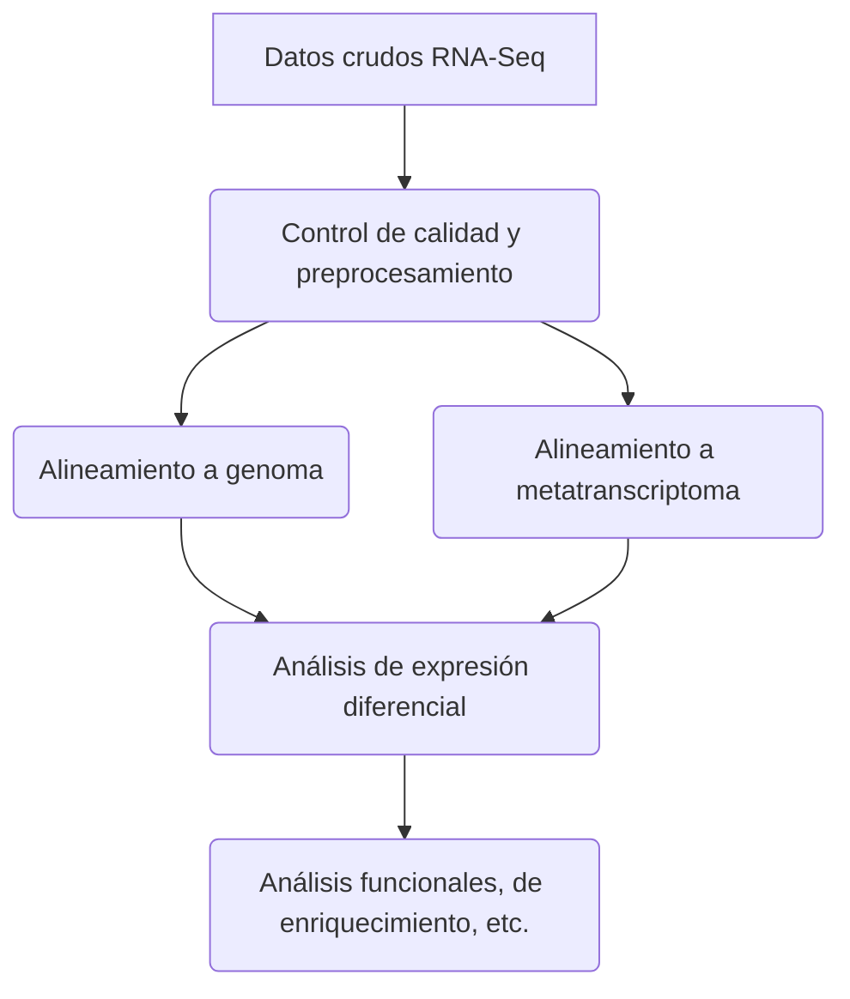

# Tutorial RNA-seq con Nexflow

## Introducción a Nexflow en bioinformática
Nextflow es una herramienta poderosa y flexible en el campo de la bioinformática que facilita la creación y ejecución de flujos de trabajo reproducibles y escalables. Su enfoque basado en el lenguaje de programación DSL (Domain-Specific Language) permite a los investigadores y bioinformáticos describir de manera intuitiva y eficiente los pasos de análisis genómico, desde la secuenciación hasta la interpretación de resultados.

Con Nextflow, los usuarios pueden definir flujos de trabajo complejos mediante la conexión de herramientas y scripts de análisis en un único y coherente script. Esto no solo simplifica la gestión y mantenimiento del código, sino que también proporciona portabilidad entre entornos de ejecución, lo que es esencial en entornos de computación distribuida o en la nube.

En esta guía introductoria, exploraremos cómo utilizar Nextflow en bioinformática, abordando desde la instalación hasta la construcción y ejecución de flujos de trabajo específicos para el análisis de datos genómicos. Este enfoque modular y eficiente puede mejorar significativamente la reproducibilidad y la colaboración en proyectos de bioinformática, permitiendo a los investigadores centrarse más en la interpretación biológica de los resultados.

## Instalación de Nextflow
### Utilizando Conda
La forma más práctica de instalar Nexflow es con Conda. Puedes seguir los siguientes pasos:

1. **Instala Miniconda o Anaconda:**
Si no tienes Miniconda o Anaconda instalado, descárgalo e instálalo desde el sitio web oficial: [Miniconda](https://docs.conda.io/en/latest/miniconda.html) o [Anaconda](https://www.anaconda.com/products/distribution).

2. **Crea un entorno Conda (opcional pero recomendado):**
Puedes optar por crear un entorno Conda específico para Nextflow para evitar posibles conflictos con otras dependencias. Para crear un entorno, ejecuta el siguiente comando en la terminal:

```bash
conda create -n nextflow
```

Luego, activa el entorno con:

```bash
conda activate nextflow
```

3. **Instala Nextflow con Conda:**
Utiliza el siguiente comando para instalar Nextflow desde el canal de Conda Bioconda:

```bash
conda install -c bioconda nextflow
```

AGREGAR SINGULARITY
conda install -c conda-forge singularity

1. **Verificación de la instalación:**
Verifica que Nextflow se haya instalado correctamente ejecutando:

```bash
nextflow -version
```

### Descarga directa

1. **Requisitos previos:**
Asegúrate de tener instalado Java en tu sistema, ya que Nextflow se ejecuta sobre la máquina virtual Java (JVM). Puedes descargar Java desde [Java SE Downloads](https://www.oracle.com/java/technologies/javase-downloads.html) o utilizar una alternativa como OpenJDK.

2. **Descarga Nextflow:**
Abre una terminal y ejecuta el siguiente comando para descargar Nextflow:

```bash
curl -s https://get.nextflow.io | bash
```

También puedes usar `wget` en lugar de `curl`:

```bash
wget -qO- https://get.nextflow.io | bash
```

Este comando descargará el script de instalación y configurará Nextflow en tu sistema.

3. **Agregar Nextflow al PATH:**
Agrega el directorio donde se encuentra el script de Nextflow al PATH del sistema. Puedes hacer esto agregando la siguiente línea al archivo de perfil de tu terminal (por ejemplo, `.bashrc` o `.zshrc`):

```bash
export PATH=$PATH:/ruta/al/directorio/nextflow
```

Recarga el perfil de la terminal o reinicia la terminal para aplicar los cambios.

```bash
# Si utilizas .bashrc
source ~/.bashrc

# Si utilizas .zshrc
source ~/.zshrc
```

4. **Verificación de la instalación:**
Verifica que Nextflow se haya instalado correctamente ejecutando el siguiente comando:

```bash
nextflow -version
```

¡Listo! Ahora tienes Nextflow instalado en tu sistema y estás listo para comenzar a trabajar con flujos de trabajo en bioinformática. Puedes encontrar más información y tutoriales en la [página oficial de Nextflow](https://www.nextflow.io/).

### Primer pipeline con Nextflow


La estructura básica de un pipeline con Nextflow es la siguiente:

```bash
// Definición de las variables
params.str = 'your name'

// Definición de las tareas
process splitLetters {
    output:
    path 'chunk_*'

    """
    printf 'Hello ${params.str}' | split -b 100 - chunk_
    """
}

process convertToUpper {
    input:
    path x

    output:
    stdout

    """
    cat $x | tr '[a-z]' '[A-Z]'
    """
}

// Ejecución del pipeline
workflow {
    splitLetters | flatten | convertToUpper | view { it.trim() }
}
```

En bioinformática, un caso más real sería el siguiente:

```bash
#!/usr/bin/env nextflow

// Definición de las variables
params.input = "input.fastq"
params.output = "output"

// Definición de las tareas
task align {
  input:
    file input_reads from params.input
  output:
    file aligned_reads to params.output

  script:
    """
    samtools align -f -q 20 -r 0 -o ${params.output} ${input_reads}
    """
}

// Ejecución del pipeline
workflow {
  align(input_reads: params.input)
}
```

En este ejemplo, la estructura básica se compone de las siguientes partes:

* Una definición de las variables, que se utilizan para almacenar los valores de entrada y salida del pipeline. En este caso, la variable params.input almacena la ruta del archivo de entrada de lecturas de secuenciación, y la variable params.output almacena la ruta del archivo de salida de las lecturas alineadas.

* Una definición de las tareas, que representan los pasos individuales que se ejecutan en el pipeline. En este caso, la tarea align alinea las lecturas de secuenciación al genoma de referencia.

* Una ejecución del pipeline, que especifica el orden en el que se ejecutan las tareas. En este caso, la tarea align se ejecuta primero, y la salida de esta tarea se utiliza como entrada para la siguiente tarea.

La estructura básica de un pipeline con Nextflow puede ser ampliada para incluir más tareas y opciones. Por ejemplo, se pueden añadir tareas adicionales para realizar el análisis de las lecturas alineadas, o se pueden especificar opciones adicionales para las tareas existentes.

A continuación se presentan algunos ejemplos de cómo ampliar la estructura básica de un pipeline con Nextflow:

**Añadir más tareas:**

```bash
// Definición de las variables
params.input = "input.fastq"
params.output = "output"

// Definición de las tareas
task align {
  input:
    file input_reads from params.input
  output:
    file aligned_reads to params.output

  script:
    """
    samtools align -f -q 20 -r 0 -o ${params.output} ${input_reads}
    """
}

task count {
  input:
    file aligned_reads from align.aligned_reads
  output:
    file counts to params.output

  script:
    """
    samtools view -F 4 -c ${params.output} > ${params.output}.counts
    """
}

// Ejecución del pipeline
workflow {
  align(input_reads: params.input)
  count(aligned_reads: align.aligned_reads)
}
```

En este ejemplo, se añade una tarea adicional denominada count, que cuenta el número de lecturas alineadas para cada posición en el genoma de referencia.

**Especificar opciones adicionales:**

```bash
// Definición de las variables
params.input = "input.fastq"
params.output = "output"

// Definición de las tareas
task align {
  input:
    file input_reads from params.input
  output:
    file aligned_reads to params.output

  script:
    """
    samtools align -f -q 20 -r 0 -o ${params.output} ${input_reads}
    """
}

// Ejecución del pipeline
workflow {
  align(input_reads: params.input,
        flags: "-q 30")
}
```

En este ejemplo, se especifica la opción -q 30 para la tarea align, lo que indica que las lecturas de secuenciación deben tener una calidad mínima de 30.

Para obtener más información sobre la estructura de los pipelines con Nextflow, se puede consultar la documentación oficial: https://www.nextflow.io/docs/latest/.

## Introducción al análisis de expresión diferencial

El análisis de expresión diferencial (DE) se utiliza para responder a la pregunta: ¿cuáles son las características genómicas (genes, transcritos o exones) que se expresan de manera significativamente diferente entre grupos de muestras? Para lograr esto, necesitamos cuantificar las diferencias entre los datos de RNA-seq para cada muestra y grupo.

Por ejemplo, en la siguiente imagen queremos comparar dos condiciones (A y B), para los genes 1 y 2; cada condición tiene 3 réplicas marcadas con colores diferentes. Podríamos observar que hay una expresión diferencial entre las condiciones: la Condición A tiene más lecturas para el gen 1, mientras que la Condición B tiene más lecturas para el gen 2. La expresión diferencial no implica que no haya expresión de uno o más genes en absoluto en una condición u otra, sino más bien que existe en una proporción diferencial considerando una secuencia de profundidad similar.


### Estructura del *Pipeline*
Para conocer cuáles son las características genómicas con expresión diferencial (DE), debemos seguir un flujo de trabajo como el que se muestra en la figura a continuación. Como vimos anteriormente, el paso fundamental es la cuantificación de los datos de RNA-seq, pero primero debemos incluir pasos previos para controlar la calidad de nuestros datos. Posteriormente, debemos alinear nuestras lecturas con el genoma (si está disponible) o el transcriptoma (que podría estar ensamblado 'de novo' con las mismas lecturas). Finalmente, realizamos el análisis de expresión diferencial y luego podemos realizar análisis funcionales, análisis de enriquecimiento, entre otros.



### Datos prueba:

Para este tutorial, trabajaremos con seis muestras: tres para el grupo de control y tres para el grupo de estudio. Estos son sus metadatos:

|grupo|muestra|
|-|-|
|Control|sub_RL514-mf|
|Control|sub_RL516-mf|
|Control|sub_RL569-mf|
|NASH|sub_RL509-mf|
|NASH|sub_RL511-mf|
|NASH|sub_RL518-mf|

### Instalación de Trinity

Para este tutorial utilizaremos Trinity, por lo cual lo necesitamos instalar así como sus dependencias. Esto se puede hacer con Conda:

```bash
conda install -c bioconda trinity salmon fastqc
```

### Pipeline de expresión diferencial con Trinity

```bash
#!/usr/bin/env nextflow

nextflow.enable.dsl = 2

// Define input parameters
params.reads = '/home/luigui/Documents/nextflow_rna_seq/rawdata/*_R{1,2}.fastq.gz'
params.samplesFile = '/home/luigui/Documents/nextflow_rna_seq/rawdata/samplesFile.tsv'
params.outdir = '/home/luigui/Documents/nextflow_rna_seq/results/de_analysis'

log.info """\
        R N A S E Q  P I P E L I N E    
        ===================================
        reads        : ${params.reads}
        outdir       : ${params.outdir}
        samplesFile :   ${params.samplesFile}
        """
        .stripIndent()

// Create Trinity 'de novo' assembly
process trinityAssembly {
    publishDir "${params.outdir}/trinityAssembly"

    input:
    path samplesFile

    output:
    path "trinityOutput"

    """
    Trinity --seqType fq --samples_file ${params.samplesFile} --max_memory 20G --CPU 16 --output trinityOutput
    """
}

// Create Salmon index
process salmonIndex {
    publishDir "${params.outdir}/salmonIndex"

    input:
    path transcriptome

    output:
    path 'index'

    script:
    """
    salmon index --threads $task.cpus -t $transcriptome/Trinity.fasta -i index
    """
}

// Quantification with Salmon
process salmonQuant {
    publishDir "${params.outdir}/salmonQuant"

    tag "$pair_id"

    input:
    path index
    tuple val(pair_id), path(reads)
    path transcriptome

    output:
    path pair_id

    script:
    """
    salmon quant --threads $task.cpus --libType=U -i $index -1 ${reads[0]} -2 ${reads[1]} -o $pair_id
    """
}

process salmonMerge {
    publishDir "${params.outdir}/salmonMerge"

    input:
    path transcriptome

    output:
    path "*"

    """
    $TRINITY_HOME/util/abundance_estimates_to_matrix.pl --est_method salmon --gene_trans_map $transcriptome/Trinity.fasta.gene_trans_map  --name_sample_by_basedir --quant_files /home/luigui/Documents/nextflow_rna_seq/rawdata/quant_files.tsv
    """
}

process edgerAnalysis {
    publishDir "${params.outdir}"

    // input:
    // path "salmonMerge/salmon.gene.counts.matrix"

    output:
    path edgeR

    """
    $TRINITY_HOME/Analysis/DifferentialExpression/run_DE_analysis.pl --matrix ${params.outdir}/salmonMerge/salmon.gene.counts.matrix --method edgeR --samples_file ${params.samplesFile} --output edgeR

    cd edgeR

    $TRINITY_HOME/Analysis/DifferentialExpression/analyze_diff_expr.pl --matrix  ${params.outdir}/salmonMerge/salmon.gene.TMM.EXPR.matrix -P 1 -C 2 --samples ${params.samplesFile}

    """
}

process deseq2Analysis {
    publishDir "${params.outdir}"

    // input:
    // path "salmonMerge/salmon.gene.counts.matrix"

    output:
    path deseq2

    """
    $TRINITY_HOME/Analysis/DifferentialExpression/run_DE_analysis.pl --matrix ${params.outdir}/salmonMerge/salmon.gene.counts.matrix --method DESeq2 --samples_file ${params.samplesFile} --output deseq2

    cd deseq2

    $TRINITY_HOME/Analysis/DifferentialExpression/analyze_diff_expr.pl --matrix  ${params.outdir}/salmonMerge/salmon.gene.TMM.EXPR.matrix -P 1 -C 2 --samples ${params.samplesFile}

    """
}

workflow {
    read_pairs_ch = channel.fromFilePairs( params.reads, checkIfExists: true )

    trinityAssembly(params.samplesFile)
    salmonIndex(trinityAssembly.out)
    salmonQuant(salmonIndex.out, read_pairs_ch, trinityAssembly.out)
    salmonMerge(trinityAssembly.out)

    edgerAnalysis()
    deseq2Analysis()
}
```
