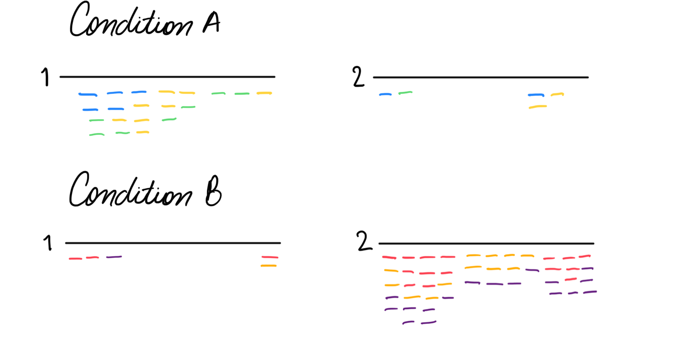
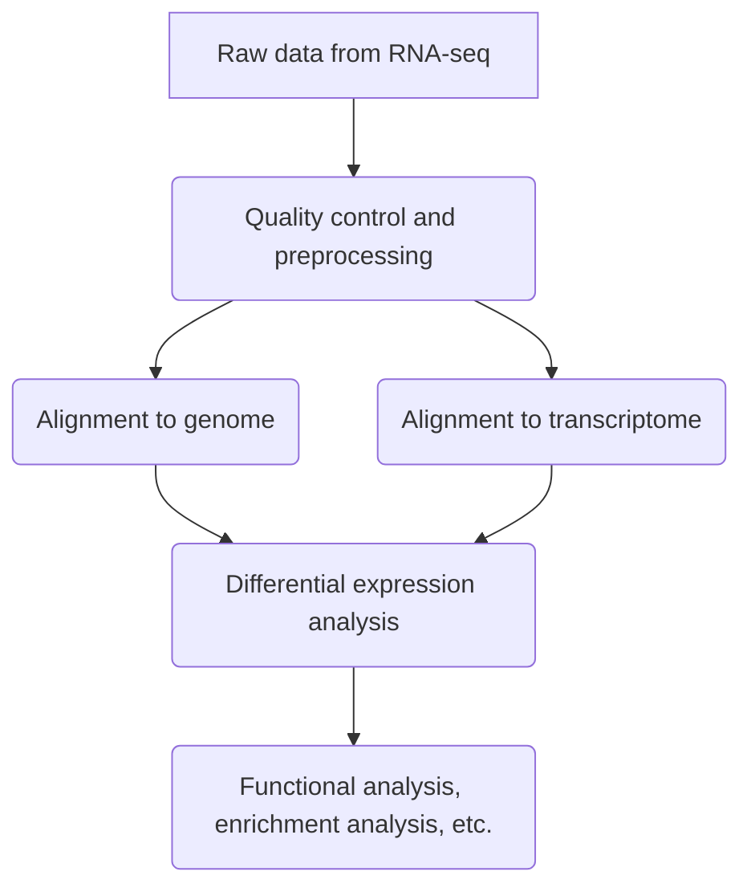

# Tutorial RNA-seq con Nexflow

## Introducción a Nexflow en bioinformática
Nextflow es una herramienta poderosa y flexible en el campo de la bioinformática que facilita la creación y ejecución de flujos de trabajo reproducibles y escalables. Su enfoque basado en el lenguaje de programación DSL (Domain-Specific Language) permite a los investigadores y bioinformáticos describir de manera intuitiva y eficiente los pasos de análisis genómico, desde la secuenciación hasta la interpretación de resultados.

Con Nextflow, los usuarios pueden definir flujos de trabajo complejos mediante la conexión de herramientas y scripts de análisis en un único y coherente script. Esto no solo simplifica la gestión y mantenimiento del código, sino que también proporciona portabilidad entre entornos de ejecución, lo que es esencial en entornos de computación distribuida o en la nube.

En esta guía introductoria, exploraremos cómo utilizar Nextflow en bioinformática, abordando desde la instalación hasta la construcción y ejecución de flujos de trabajo específicos para el análisis de datos genómicos. Este enfoque modular y eficiente puede mejorar significativamente la reproducibilidad y la colaboración en proyectos de bioinformática, permitiendo a los investigadores centrarse más en la interpretación biológica de los resultados.

## Instalación de Nextflow
### Utilizando Conda
La forma más práctica de instalar Nexflow es con Conda. Puedes seguir los siguientes pasos:

1. **Instala Miniconda o Anaconda:**
Si no tienes Miniconda o Anaconda instalado, descárgalo e instálalo desde el sitio web oficial: [Miniconda](https://docs.conda.io/en/latest/miniconda.html) o [Anaconda](https://www.anaconda.com/products/distribution).

2. **Crea un entorno Conda (opcional pero recomendado):**
Puedes optar por crear un entorno Conda específico para Nextflow para evitar posibles conflictos con otras dependencias. Para crear un entorno, ejecuta el siguiente comando en la terminal:

```bash
conda create -n nextflow
```

Luego, activa el entorno con:

```bash
conda activate nextflow
```

3. **Instala Nextflow con Conda:**
Utiliza el siguiente comando para instalar Nextflow desde el canal de Conda Bioconda:

```bash
conda install -c bioconda nextflow
```

1. **Verificación de la instalación:**
Verifica que Nextflow se haya instalado correctamente ejecutando:

```bash
nextflow -version
```

### Descarga directa


1. **Requisitos previos:**
Asegúrate de tener instalado Java en tu sistema, ya que Nextflow se ejecuta sobre la máquina virtual Java (JVM). Puedes descargar Java desde [Java SE Downloads](https://www.oracle.com/java/technologies/javase-downloads.html) o utilizar una alternativa como OpenJDK.

2. **Descarga Nextflow:**
Abre una terminal y ejecuta el siguiente comando para descargar Nextflow:

```bash
curl -s https://get.nextflow.io | bash
```

También puedes usar `wget` en lugar de `curl`:

```bash
wget -qO- https://get.nextflow.io | bash
```

Este comando descargará el script de instalación y configurará Nextflow en tu sistema.

3. **Agregar Nextflow al PATH:**
Agrega el directorio donde se encuentra el script de Nextflow al PATH del sistema. Puedes hacer esto agregando la siguiente línea al archivo de perfil de tu terminal (por ejemplo, `.bashrc` o `.zshrc`):

```bash
export PATH=$PATH:/ruta/al/directorio/nextflow
```

Recarga el perfil de la terminal o reinicia la terminal para aplicar los cambios.

```bash
# Si utilizas .bashrc
source ~/.bashrc

# Si utilizas .zshrc
source ~/.zshrc
```

4. **Verificación de la instalación:**
Verifica que Nextflow se haya instalado correctamente ejecutando el siguiente comando:

```bash
nextflow -version
```

¡Listo! Ahora tienes Nextflow instalado en tu sistema y estás listo para comenzar a trabajar con flujos de trabajo en bioinformática. Puedes encontrar más información y tutoriales en la [página oficial de Nextflow](https://www.nextflow.io/).

## Introducción al análisis de expresión diferencial
El análisis de expresión diferencial (DE) se utiliza para responder a la pregunta: ¿cuáles son las características genómicas (genes, transcritos o exones) que se expresan de manera significativamente diferente entre grupos de muestras? Para lograr esto, necesitamos cuantificar las diferencias entre los datos de RNA-seq para cada muestra y grupo.

Por ejemplo, en la siguiente imagen queremos comparar dos condiciones (A y B), para los genes 1 y 2; cada condición tiene 3 réplicas marcadas con colores diferentes. Podríamos observar que hay una expresión diferencial entre las condiciones: la Condición A tiene más lecturas para el gen 1, mientras que la Condición B tiene más lecturas para el gen 2. La expresión diferencial no implica que no haya expresión de uno o más genes en absoluto en una condición u otra, sino más bien que existe en una proporción diferencial considerando una secuencia de profundidad similar.



### Estructura del *Pipeline*
Para conocer cuáles son las características genómicas con expresión diferencial (DE), debemos seguir un flujo de trabajo como el que se muestra en la figura a continuación. Como vimos anteriormente, el paso fundamental es la cuantificación de los datos de RNA-seq, pero primero debemos incluir pasos previos para controlar la calidad de nuestros datos. Posteriormente, debemos alinear nuestras lecturas con el genoma (si está disponible) o el transcriptoma (que podría estar ensamblado 'de novo' con las mismas lecturas). Finalmente, realizamos el análisis de expresión diferencial y luego podemos realizar análisis funcionales, análisis de enriquecimiento, entre otros.



### Ejemplo:

Para este tutorial, trabajaremos con seis muestras: tres para el grupo de control y tres para el grupo de estudio. Estos son sus metadatos:

|group|sample|R1|R2|
|-|-|-|-|
|dextrose|D1|D1_R1.fastq.gz|D1_R2.fastq.gz|
|dextrose|D2|D2_R1.fastq.gz|D2_R2.fastq.gz|
|dextrose|D3|D3_R1.fastq.gz|D3_R2.fastq.gz|
|impranil|I1|I1_R1.fastq.gz|I1_R2.fastq.gz|
|impranil|I2|I2_R1.fastq.gz|I2_R2.fastq.gz|
|impranil|I3|I3_R1.fastq.gz|I3_R2.fastq.gz|

### Calcular expresión con RSEM
En este ejemplo, vamos a alinear nuestros datos de RNA-seq con el genoma de referencia utilizando RSEM, pero este método también se podría utilizar con un transcriptoma. Este algoritmo permite manejar lecturas que se asignan a múltiples genes o isoformas, un desafío común en los datos de RNA-seq

```bash
rsem-calculate-expression --star --star-gzipped-read-file --append-names -p 60 --paired-end D1_1.fastq.gz D1_2.fastq.gz genoma_A3I1_rsem D1_rsem

rsem-calculate-expression --star --star-gzipped-read-file --append-names -p 60 --paired-end D2_1.fastq.gz D2_2.fastq.gz genoma_A3I1_rsem D2_rsem

rsem-calculate-expression --star --star-gzipped-read-file --append-names -p 60 --paired-end D3_1.fastq.gz D3_2.fastq.gz genoma_A3I1_rsem D3_rsem

rsem-calculate-expression --star --star-gzipped-read-file --append-names -p 60 --paired-end I1_1.fastq.gz I1_2.fastq.gz genoma_A3I1_rsem I1_rsem

rsem-calculate-expression --star --star-gzipped-read-file --append-names -p 60 --paired-end I2_1.fastq.gz I2_2.fastq.gz genoma_A3I1_rsem I2_rsem

rsem-calculate-expression --star --star-gzipped-read-file --append-names -p 60 --paired-end I3_1.fastq.gz I3_2.fastq.gz genoma_A3I1_rsem I3_rsem
```

Este un ejemplo de la salida: 

| transcript_id | gene_id    | length | effective_length | expected_count | TPM   | FPKM  | IsoPct |
| ------------- | ---------- | ------ | ---------------- | -------------- | ----- | ----- | ------ |
| gene_00001.t1 | gene_00001 | 1053   | 856.86           | 52             | 9.77  | 10.88 | 100    |
| gene_00002.t1 | gene_00002 | 2455   | 2258.86          | 9              | 0.64  | 0.71  | 100    |
| gene_00003.t1 | gene_00003 | 2349   | 2152.86          | 351            | 26.24 | 29.24 | 100    |
| gene_00004.t1 | gene_00004 | 2002   | 1805.86          | 332            | 29.59 | 32.97 | 100    |
| gene_00005.t1 | gene_00005 | 1506   | 1309.86          | 2              | 0.25  | 0.27  | 100    |
| gene_00006.t1 | gene_00006 | 1053   | 856.86           | 0              | 0     | 0     | 0      |
| gene_00007.t1 | gene_00007 | 3840   | 3643.86          | 1              | 0.04  | 0.05  | 100    |
| gene_00008.t1 | gene_00008 | 2751   | 2554.86          | 5              | 0.31  | 0.35  | 100    |
| gene_00009.t1 | gene_00009 | 480    | 283.91           | 1              | 0.57  | 0.63  | 100    |

### Expresión diferencial DESeq2

Hay muchos algoritmos utilizados para realizar análisis de expresión diferencial, uno de los más utilizados es DESeq2. Podemos usar el paquete R, para instalarlo ejecutamos lo siguiente dentro de R:

```R
#### Instalation of BiocManager, DESeq2, apeglm
#### Run only once in your computer
if (!requireNamespace("BiocManager", quietly = TRUE))
    install.packages("BiocManager")
BiocManager::install("DESeq2")
BiocManager::install("apeglm")

#### Optional libraries to generate graphs: instalation of ggplot2, pheatmap and RColorBrewer
#### Run only once in your computer
install.packages("ggplot2")
install.packages("pheatmap")
install.packages("RColorBrewer")

#### Load libraries
library(DESeq2)
library(apeglm)

#### Load optional libraries
library(ggplot2)
library(pheatmap)
library(RColorBrewer)
```

Después, importamos la matriz de recuento (generada con RSEM) y el archivo de metadatos con la correspondencia muestra-grupo. Este es el encabezado de nuestra matriz de `RSEM.genes.counts.matrix`:

|            | D1_rsem | D2_rsem | D3_rsem | I1_rsem | I2_rsem | I3_rsem |
| ---------- | ------- | ------- | ------- | ------- | ------- | ------- |
| gene_09063 | 174     | 131     | 147     | 10      | 9       | 12      |
| gene_12878 | 32      | 44      | 37      | 18      | 20      | 22      |
| gene_12066 | 11      | 9       | 6       | 1       | 1       | 0       |
| gene_12117 | 68      | 80      | 73      | 27      | 29      | 17      |
| gene_00424 | 662     | 658     | 1033    | 473     | 493     | 438     |
| gene_06101 | 70      | 65      | 80      | 11      | 9       | 8       |
| gene_08260 | 518     | 590     | 615     | 180     | 178     | 211     |
| gene_06056 | 23      | 17      | 26      | 9       | 6       | 2       |
| gene_06489 | 37      | 33      | 31      | 369     | 353     | 365     |

Y nuestro `metadata.tsv`

||group|
|-|-|
|dextrosa_rep1|dextrosa|
|dextrosa_rep2|dextrosa|
|dextrosa_rep3|dextrosa|
|impranil_rep1|impranil|
|impranil_rep2|impranil|
|impranil_rep3|impranil|

Ahora, dentro de R, ejecutamos el código a continuación para ingresar nuestros datos de ejemplo:

```R
rsem_count <- as.matrix(read.delim(file = "RSEM.gene.counts.matrix",
    sep="\t",
    row.names = 1))

column_data <- read.csv(file = "metadata.tsv",
    sep = "\t")

deseq_data_set <- DESeqDataSetFromMatrix(countData = rsem_count,
    colData = column_data,
    design = ~group)

deseq_data_set$group <- relevel(deseq_data_set$group,
    ref = "dextrosa")
```

Como recomendación, se recomienda remover los transcritos con baja abundancia:

```R
keep <- rowSums(counts(deseq_data_set)) >= 10

deseq_data_set <- deseq_data_set[keep,]
```

Con la matrix filtrada, podemos iniciar con el análisis de expresión diferencial:

```R
dif_expression_deseq_data_set <- DESeq(deseq_data_set)

res_dif_expression_deseq_data_set <- results(dif_expression_deseq_data_set)

summary_dif_expression_deseq_data_set <- summary(res_dif_expression_deseq_data_set)
```

Podemos filtrar los resultados, como el *p-value* y *log2 fold change*:

We could filter the results, like the p-value and log2 fold change:

```R
res05_dif_expression_deseq_data_set <- results(dif_expression_deseq_data_set,
    alpha=0.05)

summary_dif_expression_deseq_data_set <- summary(res05_dif_expression_deseq_data_set)
```

Finalmente para exportar la tabla, corremos:

```R
write.table(as.data.frame(res05_dif_expression_deseq_data_set),sep = '\t' ,
    file="results.tsv")
```

### Gráficas
Después de obtener la matriz final de DESeq2, podemos general diversas gráficas. Por ejemplo, para general una gráfica de volcán (*Volcano plot*) corremos lo siguiente:

```R
png("volcano_plot.png")

plotMA(res05_dif_expression_deseq_data_set,
    ylim=c(-10,10))

dev.off()
```


Para generar una gráfica individual (una sola característica) corremos:

```R
png("TRINITY_DN1097_c0_g1.png")

plotCounts(dif_expression_deseq_data_set,
    gene= "TRINITY_DN1097_c0_g1",
    intgroup="group")

dev.off()
```


Podríamos generar un mapa de calor con una selección de los transcritos. En el ejemplo a continuación, obtenemos los primeros 20 transcritos y los representamos en un mapa de calor:

```R
select <- order(rowMeans(counts(dif_expression_deseq_data_set,normalized=TRUE)),
    decreasing=TRUE)[1:20]

df <- as.data.frame(colData(dif_expression_deseq_data_set)[,c("X","group")])

png("heatmap.png")

pheatmap(assay(dif_expression_deseq_data_set)[select,],
    cluster_rows=FALSE,
    show_rownames=FALSE,
    cluster_cols=FALSE,
    annotation_col=df)

dev.off()
```


Para generar un PCA:

```R
vsd <- vst(dif_expression_deseq_data_set, blind=FALSE)

png("PCA.png")

plotPCA(vsd, intgroup=c("group"))

dev.off()
```

